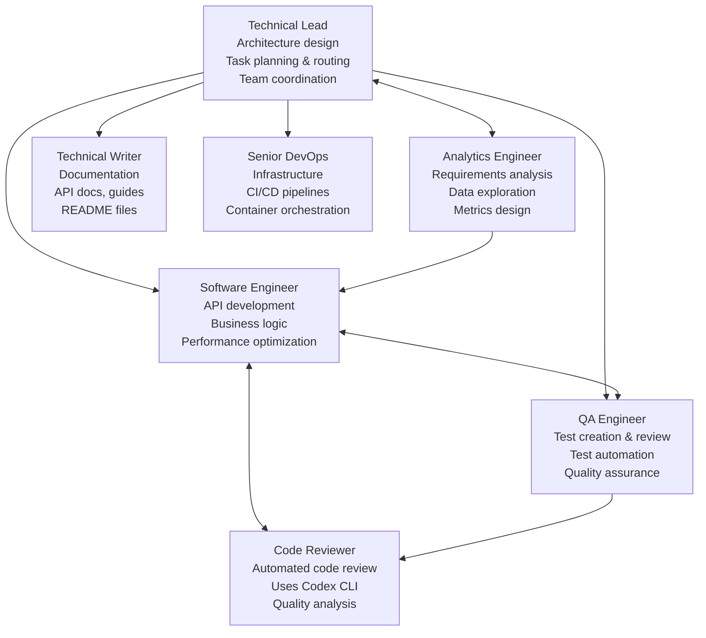
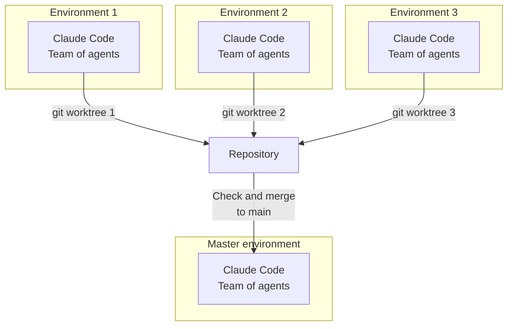

# Isolated AI Development Environments

> ⚠️ **This system is under active development** - expect frequent updates and improvements.
> 
> 💡 **We welcome your ideas!** Feel free to share suggestions, use cases, or feedback in the [Discussions](https://github.com/alexsteeel/ai-agents-sandbox/discussions) section.

This repository is a **foundation** (with a **full working example**) for per-task, **agent-centric** development.
It lets you run several tasks **in parallel**, each in its **own isolated environment**.

## What it does

* **Per-task isolation.** Each task lives in its own Git **worktree** with its own containers and network.
* **Agent-centric workflow.** The **AI agents** run **together** in the same sandbox (Claude Code, Codex CLI, Gemini CLI …).
* **Pluggable services.** Start the services you need (DBs, object storage, caches, brokers, vector stores, …).
* **Highly customizable.** Swap agents, services, env vars, and compose files.

## Security model

* **Non-root users.** Default user inside containers is **non-root** (user: claude, UID: 1001).
  * **Write access only to:** the **workspace** and the user's **home directory**.
  * No write access elsewhere; **no `sudo`** in images.
  * Group `local-ai-team` (GID: 3000) for shared file access between host and container.

* **Restricted networking.** **Default-deny egress**; outbound HTTP/HTTPS goes through **Tinyproxy** with whitelist filtering.
  * **Upstream proxy support:** Optional SOCKS5/HTTP upstream proxy for additional routing (e.g., SSH tunnels).
  * **Docker registry proxy:** Transparent caching proxy for Docker images, isolated from host network.

* **Isolated Docker.** Docker-in-Docker is **network-isolated** and constrained; it cannot access host Docker or host files.
  * Uses **docker-registry-proxy** for all image pulls with transparent caching.
  * Registry domains automatically whitelisted (Docker Hub, gcr.io, quay.io, registry.k8s.io, ghcr.io).

* **Constrained devcontainer.** Minimal capabilities and internal networking only.

* **Parallel safety.** Multiple environments run side-by-side **without colliding** over resources, tables, or dashboards.

* **Host notifications.** Secure notification system using mounted volumes for container-to-host alerts.

---

# Architecture — Components & Networks


---

# AI Agents

Pre-configured agents included in the base image:



---

# Parallel Tasks — Multi-Environment Workflow



---

## Quick start

### One-Time Setup

```bash
# System-wide installation (requires sudo)
./install.sh
# This automatically:
# - Builds all Docker images (if not already built)
# - Installs management commands
# - Sets up templates and configurations
# - Creates local-ai-team group
# - Installs shell completions

# The ai-sbx command is installed with subcommands:
# - ai-sbx worktree create: Create git worktree for new tasks
# - ai-sbx worktree connect: Connect to existing task worktree  
# - ai-sbx worktree remove: Remove git worktree and optionally its branch
# - ai-sbx init: Initialize project with proper permissions
# - ai-sbx notify: Start notification watcher for container alerts
```

### Rebuilding Images

You can rebuild images at any time with custom tag using the build script:

```bash
# Rebuild all images (useful after updates)
./images/build.sh all

# Force rebuild (ignores cache)
./images/build.sh --force all

# Rebuild with custom version tag
IMAGE_TAG=1.0.3 ./images/build.sh all

# Combine force and custom tag
IMAGE_TAG=1.0.3 ./images/build.sh --force all

# Rebuild specific image only
./images/build.sh --force devcontainer
```

**When to rebuild:**
- After pulling updates from the repository
- When changing Dockerfile configurations
- To apply security updates to base images
- When switching between versions

**Version management:**
- Default tag is `latest`
- Set `IMAGE_TAG` environment variable for versioning
- Update your `override.user.yaml` to use specific versions

### Using in Your Project

1. **Copy `.devcontainer.example/` to your project:**
   ```bash
   cp -r /path/to/ai_agents_sandbox/.devcontainer.example /path/to/your-project/.devcontainer
   ```

2. **Initialize project:**
   ```bash
   ai-sbx init /path/to/your-project
   # This sets up permissions, creates .env, configures mounts
   ```

3. **Configure (optional):**
   ```bash
   cd /path/to/your-project/.devcontainer
   vim override.user.yaml  # Add services, domains, environment variables
   ```

4. **Open in your IDE** (handles everything automatically):
   
   **VS Code:**
   - Open project folder
   - Click "Reopen in Container" when prompted
   - VS Code manages the container lifecycle
   
   **PyCharm (DevContainer setup):**
   - Open project folder in PyCharm
   - Install **Dev Containers** plugin from JetBrains Marketplace
   - Go to **Tools** → **Dev Containers** → **Create Dev Container**
   - Select the `.devcontainer` folder in your project
   - Click **Create and Open**
   - PyCharm will build and start the DevContainer
   
   **Alternative PyCharm setup (Docker Compose Interpreter):**
   - Go to **Settings** → **Build, Execution, Deployment** → **Docker**
   - Configure Docker connection if needed
   - Go to **Project** → **Python Interpreter**
   - Click gear icon → **Add** → **Docker Compose**
   - Configuration files: Point to `.devcontainer/local.project.yaml`
   - Service: `devcontainer`
   - Python interpreter: `/usr/local/bin/python`
   - PyCharm manages the container lifecycle
   
5. **For parallel tasks** (optional):
   ```bash
   # Create worktree for new task:
   ai-sbx worktree create "feature 123 implement user auth"
   ```

### Available Commands

```bash
# Main command
ai-sbx <command> [arguments]

# Worktree management
ai-sbx worktree create "task description"  # Create new task worktree
ai-sbx worktree connect                    # Connect to existing worktree
ai-sbx worktree remove [name]              # Remove worktree
ai-sbx worktree list                       # List all worktrees

# Project initialization
ai-sbx init [/path/to/project]             # Initialize project

# Notifications
ai-sbx notify                               # Start notification watcher

# Help
ai-sbx --help                              # Show general help
ai-sbx worktree --help                     # Show worktree help
```

**Note:** Your IDE (VS Code/PyCharm) handles starting, stopping, and managing containers automatically. No manual Docker commands needed!

## What's in `.devcontainer.example/`

A ready-to-use template for new projects:

- **`devcontainer.json`** - IDE configuration (VS Code/PyCharm compatible)
- **`local.project.yaml`** - Project-specific services (empty by default)
- **`override.user.yaml`** - User customizations and overrides
- **`.env.example`** - Environment configuration template
- **`Dockerfile`** - Shows how to extend the base image
- **`init-project.sh`** - Wrapper script for project initialization
- **`secure.init.sh.template`** - Template for sensitive configuration
- **`CLAUDE.md`** - Detailed technical documentation
- **`README.md`** - User documentation for the template
- **`.gitignore`** - Ignores sensitive files (.env, secure.init.sh)

### Minimal Setup

For the absolute minimum, you need these files in `.devcontainer/`:

1. **`devcontainer.json`**:
```json
{
  "name": "${localWorkspaceFolderBasename} - AI Sandbox",
  "dockerComposeFile": ["local.project.yaml",
    "/usr/local/share/ai-agents-sandbox/docker-compose.base.yaml",
    "override.user.yaml"
  ],
  "service": "devcontainer",
  "workspaceFolder": "/workspace",
  "initializeCommand": ".devcontainer/init-project.sh \"${localWorkspaceFolder}\""
}
```

2. **`local.project.yaml`** (empty):
```yaml
services: {}
```

3. **`override.user.yaml`** (minimal):
```yaml
services:
  devcontainer:
    image: ai-agents-sandbox/devcontainer:latest
```

4. **`init-project.sh`** (wrapper):
```bash
#!/bin/bash
if command -v ai-sbx-init-project >/dev/null 2>&1; then
    ai-sbx-init-project "${1:-$(dirname $(dirname $0))}"
fi
```

## Network Configuration

### Proxy Configuration

#### Web Access (Tinyproxy)
- **Default-deny** with whitelist filtering
- Pre-configured domains: GitHub, GitLab, PyPI, npm, JetBrains
- Add project domains in `override.user.yaml`:
  ```yaml
  services:
    tinyproxy-devcontainer:
      environment:
        USER_WHITELIST_DOMAINS: api.myproject.com,cdn.myproject.com
  ```

#### Docker Registry Proxy
- Transparent caching for Docker images
- Auto-configured for Docker Hub, gcr.io, quay.io, registry.k8s.io, ghcr.io
- ~9x faster pulls for large images (OpenSearch: 113s → 13s)
- Shared cache across all projects

### Upstream Proxy Support
Configure optional upstream proxy in `override.user.yaml`:

```yaml
services:
  tinyproxy-devcontainer:
    environment:
      # Simple format - just specify proxy URL
      UPSTREAM_PROXY: socks5://host.docker.internal:8900
      # or http://host.docker.internal:3128
      
      # Domains that bypass the upstream proxy
      NO_UPSTREAM: github.com,gitlab.com
```

For SSH tunnels:
```bash
ssh -D 0.0.0.0:8900 your-server  # Creates SOCKS5 proxy
```

### Testing Network
```bash
docker exec devcontainer /home/claude/scripts/test-network.sh
```

## Notification System

The environment includes a host notification system for alerts from Claude Code:

### Setup
1. Notification directory is created automatically during installation
2. Install inotify-tools for instant notifications:
   ```bash
   sudo apt-get install inotify-tools  # Debian/Ubuntu
   ```
3. Start the notification watcher on your host:
   ```bash
   ai-sbx-notify-watch  # Installed system-wide by ./install.sh
   ```

### How it works
- Claude Code writes notifications to `/home/claude/.ai_agents_sandbox/notifications` in container
- This is mounted to `$HOME/.ai_agents_sandbox/notifications` on host
- Host watcher monitors the directory and shows desktop alerts
- Supports different urgency levels (error, complete, clarification, approval, blocked)

### Testing
From within the container:
```bash
/home/claude/claude-defaults/hooks/notify.sh test "Hello from container!"
```

## Building Docker Images

The system requires several Docker images to function. You can build them using the provided build script:

### Build All Images (Recommended)
```bash
cd /path/to/ai-agents-sandbox
./images/build.sh all
```

This builds:
- `ai-agents-sandbox/devcontainer:latest` - Base development container
- `ai-agents-sandbox/tinyproxy:latest` - HTTP/HTTPS proxy with filtering
- `ai-agents-sandbox/tinyproxy-base:latest` - Base proxy image
- `ai-agents-sandbox/tinyproxy-registry:latest` - Registry-specific proxy
- `ai-agents-sandbox/docker-dind:latest` - Docker-in-Docker service
- `ai-agents-sandbox/devcontainer-dotnet:latest` - .NET development variant
- `ai-agents-sandbox/devcontainer-golang:latest` - Go development variant

### Build Specific Images
```bash
# Build only the base devcontainer
./images/build.sh devcontainer

# Build only the proxy
./images/build.sh tinyproxy

# Build Docker-in-Docker
./images/build.sh docker-dind

# Build language-specific variants
./images/build.sh devcontainer-dotnet
./images/build.sh devcontainer-golang
```

### Verify Images
```bash
# List all ai-agents-sandbox images
docker images | grep ai-agents-sandbox

# Expected output:
# ai-agents-sandbox/devcontainer      latest    ...
# ai-agents-sandbox/tinyproxy         latest    ...
# ai-agents-sandbox/docker-dind       latest    ...
```

### Image Versioning
All images are tagged with version `1.0.0` by default. To use specific versions:
```bash
# Build with custom tag
IMAGE_TAG=1.1.0 ./images/build.sh all

# Use in your override.user.yaml:
services:
  devcontainer:
    image: ai-agents-sandbox/devcontainer:1.1.0
```

## Customization

Extend the foundation for your specific needs:

* **Add services:** Edit `local.project.yaml` to add databases, caches, message brokers, vector stores
* **Configure domains:** Add allowed domains in `override.user.yaml`:
  ```yaml
  services:
    tinyproxy-devcontainer:
      environment:
        USER_WHITELIST_DOMAINS: api.myproject.com,cdn.myproject.com
  ```
* **Extend base image:** Configure in `override.user.yaml` and create `Dockerfile`:
  ```yaml
  services:
    devcontainer:
      build:
        context: .
        dockerfile: Dockerfile
  ```
* **Environment variables:** Set project-specific vars in `override.user.yaml`

See `.devcontainer.example/` for complete customization examples.

## Acknowledgments

This project uses and extends the following excellent open-source projects:

- **[docker-registry-proxy](https://github.com/rpardini/docker-registry-proxy)** - Transparent caching proxy for Docker registries with HTTPS interception
- **[Tinyproxy](https://github.com/tinyproxy/tinyproxy)** - Lightweight HTTP/HTTPS proxy daemon for POSIX systems
- **[Docker-in-Docker](https://github.com/docker-library/docker)** - Official Docker image for Docker-in-Docker functionality

Special thanks to the maintainers and contributors of these projects for making secure, isolated development environments possible.