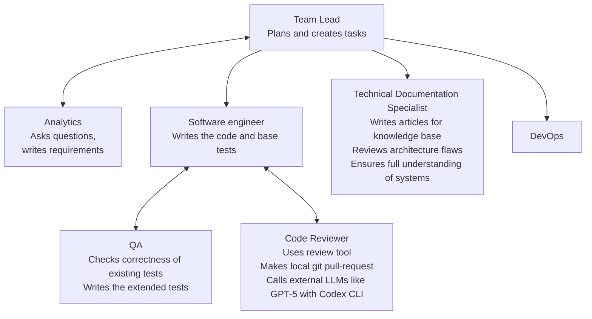
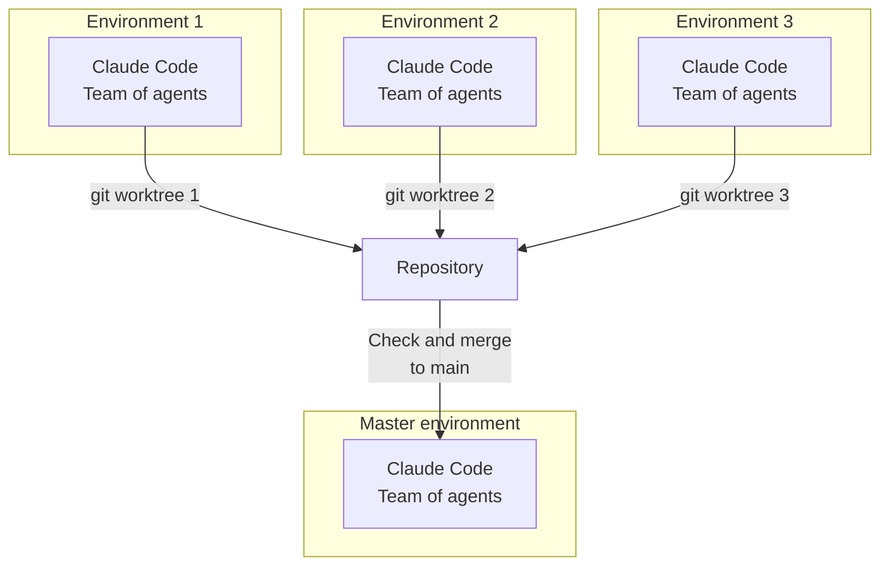

# Isolated AI Development Environments — Foundation + Full Example

This repository is a **foundation** (with a **full working example**) for per-task, **agent-centric** development.
It lets you run several tasks **in parallel**, each in its **own isolated environment**, on a **Host PC** or a **Dev-Container PC**.

## What it does

* **Per-task isolation.** Each task lives in its own Git **worktree** with its own containers and network.
* **Agent-centric workflow.** The **user and AI agents** run **together** in the same sandbox (Claude Code, Codex CLI, Gemini CLI, Qwen Coder, …).
* **Pluggable services.** Start the services you need (DBs, object storage, caches, brokers, vector stores, …).
* **Portable by design.** Move a worktree between machines and reopen it with the same constraints and proxy rules.
* **Highly customizable.** Swap agents, services, env vars, and compose files without modifying the base.

## Security model (simple, strict, practical)

* **Non-root users.** Default user inside containers is **non-root** (user: claude, UID: 1001).

  * **Write access only to:** the **workspace** and the user's **home directory**.
  * No write access elsewhere; **no `sudo`** in images.
* **Restricted networking.** **Default-deny egress**; outbound HTTP/HTTPS goes through **Tinyproxy** with whitelist filtering.
  * **Upstream proxy support:** Optional SOCKS5/HTTP upstream proxy for additional routing (e.g., SSH tunnels).
* **Isolated Docker.** Docker-in-Docker is **network-isolated** and constrained; it cannot access host Docker or host files.
* **Constrained devcontainer.** Minimal capabilities and internal networking only.
* **Parallel safety.** Multiple environments run side-by-side **without colliding** over resources, tables, or dashboards.

---

# Architecture — Components & Networks


## Directory Structure

```
.
├── build.sh                    # Unified build script for all images
├── common_settings/            # Shared configuration
│   └── default-whitelist.txt   # Default allowed domains
├── devcontainer_base/          # Base devcontainer image
│   ├── Dockerfile              # Multi-stage build with tools
│   ├── scripts/                # Utility scripts
│   │   ├── test-network.sh     # Network connectivity tests
│   │   ├── get-whitelist.sh    # Domain whitelist manager
│   │   └── ...                 # Other utilities
│   └── claude-defaults/        # AI agent configurations
├── tinyproxy_extended/         # Custom Tinyproxy image
│   ├── Dockerfile              # Tinyproxy with whitelist support
│   ├── entrypoint.sh           # Dynamic configuration
│   └── tinyproxy.conf          # Base configuration
└── .devcontainer/              # Project devcontainer (copy to your project)
    ├── docker-compose.yaml     # Service orchestration
    ├── Dockerfile              # Extends base image
    ├── .env.example            # Environment template
    ├── whitelist.txt           # Project-specific domains
    └── initialize.sh           # One-time setup script
```

---

# AI Agents



---

# Parallel Tasks — Multi-Environment Workflow



---

## Quick start

1. Build both base images once:

   ```bash
   ./build.sh  # Builds devcontainer and tinyproxy images
   ```

2. Copy the `.devcontainer/` directory into your project root.

3. Configure environment:
   ```bash
   cd .devcontainer
   cp .env.example .env
   # Edit .env to configure proxy settings if needed
   ```

4. Initialize and start services:
   ```bash
   ./initialize.sh  # One-time setup
   docker compose up -d  # Start services
   ```

5. Open the project in your IDE:
   - **VS Code:** Automatically detects `.devcontainer/devcontainer.json`
   - **JetBrains IDEs:** Open project → **Open in Dev Container**

6. (Optional) Add project-specific domains to `.devcontainer/whitelist.txt`.

## Create a task environment (worktree)

```bash
# from your main repo
git worktree add ../task-foo -b feature/task-foo
# open ../task-foo in the IDE; it spins up its own isolated environment
```

## Network Configuration

### Proxy Filtering
- **Tinyproxy** enforces whitelist-based filtering (default-deny)
- Default whitelisted domains in `common_settings/default-whitelist.txt`:
  - GitHub, GitLab, PyPI, npm registry, JetBrains services
- Add project-specific domains to `.devcontainer/whitelist.txt`

### Upstream Proxy Support
Configure optional upstream proxy in `.devcontainer/.env`:

```bash
# SOCKS5 proxy (e.g., SSH tunnel)
UPSTREAM_SOCKS5=host.docker.internal:8900

# HTTP proxy
UPSTREAM_HTTP=host.docker.internal:3128
```

For SSH tunnels:
```bash
ssh -D 0.0.0.0:8900 your-server  # Creates SOCKS5 proxy
```

### Testing Network
```bash
docker exec claude-sandbox /home/claude/scripts/test-network.sh
```

## Customize

* **Agents.** Install or swap agents (Claude Code, Codex CLI, Gemini CLI, Qwen Coder, …).
* **Services.** Edit the *service compose* to add DBs, caches, brokers, vector stores, etc.
* **Policy.** Adjust the proxy whitelist and egress rules; keep default-deny for safety.
* **Overrides.** Use compose overrides and env files to tailor paths, volumes, and resources—while the user stays **non-root** with write access limited to **workspace + home**.

---

*This repository is the **foundation with a complete working example**. It’s minimal, portable, secure by default, and easy to extend for your agents and services.*