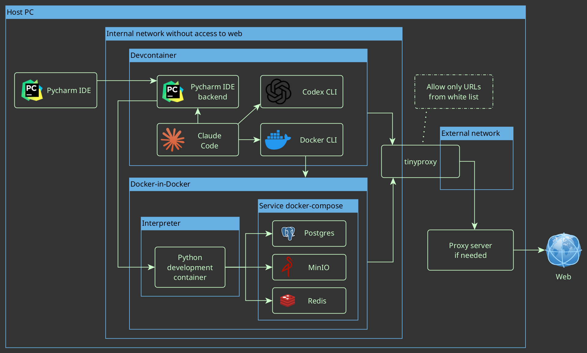
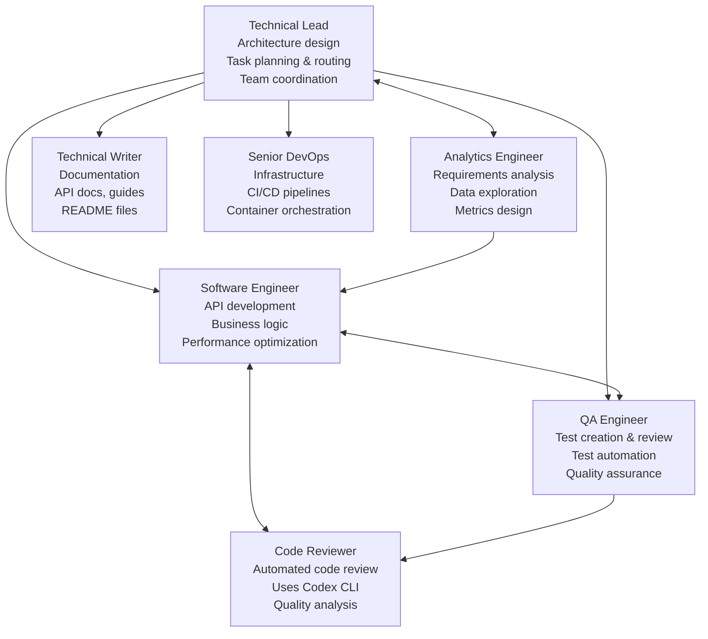
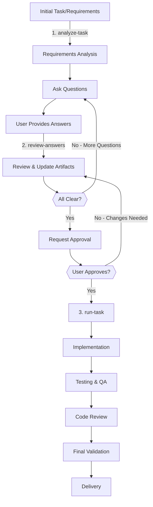
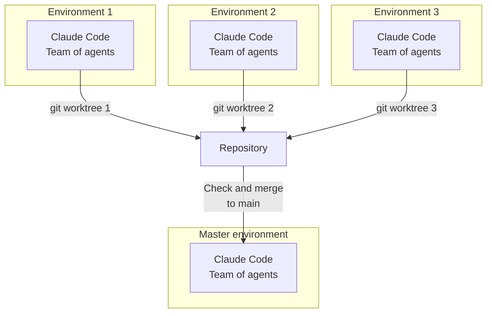

# Isolated AI Development Environments

> ⚠️ **This system is under active development** - expect frequent updates and improvements.

This repository is a **foundation** (with a **full working example**) for per-task, **agent-centric** development.
It lets you run several tasks **in parallel**, each in its **own isolated environment**.

## What it does

* **Per-task isolation.** Each task lives in its own Git **worktree** with its own containers and network.
* **Agent-centric workflow.** The **AI agents** run **together** in the same sandbox (Claude Code, Codex CLI, Gemini CLI …).
* **Pluggable services.** Start the services you need (DBs, object storage, caches, brokers, vector stores, …).
* **Highly customizable.** Swap agents, services, env vars, and compose files without modifying the base.

## Security model

* **Non-root users.** Default user inside containers is **non-root** (user: claude, UID: 1001).
  * **Write access only to:** the **workspace** and the user's **home directory**.
  * No write access elsewhere; **no `sudo`** in images.
  * Group `dev` (GID: 2000) for shared file access between host and container.

* **Restricted networking.** **Default-deny egress**; outbound HTTP/HTTPS goes through **Tinyproxy** with whitelist filtering.
  * **Upstream proxy support:** Optional SOCKS5/HTTP upstream proxy for additional routing (e.g., SSH tunnels).
  * **Dual proxy setup:** Separate proxies for devcontainer and Docker-in-Docker with different whitelists.

* **Isolated Docker.** Docker-in-Docker is **network-isolated** and constrained; it cannot access host Docker or host files.

* **Constrained devcontainer.** Minimal capabilities and internal networking only.

* **Parallel safety.** Multiple environments run side-by-side **without colliding** over resources, tables, or dashboards.

* **Host notifications.** Secure notification system using mounted volumes for container-to-host alerts.

---

# Architecture — Components & Networks



---

# AI Agents

Pre-configured agents included in the base image:



---

# Task Execution Workflow

The environment includes a structured workflow for taking tasks from requirements to implementation:



### Workflow Commands:
1. **`analyze-task`**: Initial requirements analysis
   - Reads task description
   - Identifies potential issues and risks
   - Creates `requirements.md`, `answers.md`, `plan.md`
   - Asks critical clarifying questions

2. **`review-answers`**: Iterative clarification
   - Reviews user-provided answers
   - Updates task artifacts based on new information
   - Identifies remaining unclear points
   - Repeats until all requirements are clear

3. **`run-task`**: Implementation phase
   - Executes approved plan
   - Coordinates with specialized agents (Software, QA, DevOps)
   - Runs testing and validation
   - Delivers final implementation

All task artifacts are stored in `tasks/<task_name>/` folders for organization and tracking.

---

# Parallel Tasks — Multi-Environment Workflow



---

## Quick start

### One-Time Setup (System-wide Installation)

```bash
# Install everything (builds images + installs helper commands)
./install.sh

# This installs these commands system-wide:
# - claude-task-worktree: Create git worktree for new tasks
# - claude-notify-watch: Host notification watcher (optional)
```

### Using in Your Project

1. **Copy `.devcontainer.example/` to your project:**
   ```bash
   cp -r /path/to/ai_agents_sandbox/.devcontainer.example /path/to/your-project/.devcontainer
   ```

2. **Configure (optional):**
   ```bash
   cd /path/to/your-project/.devcontainer
   vim .env  # Set PROJECT_NAME, configure proxy if needed
   vim whitelist.txt  # Add your project's domains
   ```

3. **Open in your IDE** (handles everything automatically):
   
   **VS Code:**
   - Open project folder
   - Click "Reopen in Container" when prompted
   - VS Code manages the container lifecycle
   
   **PyCharm:**
   - Open project folder in PyCharm
   - Go to **Settings** → **Project** → **Python Interpreter**
   - Click the gear icon → **Add**
   - Select **Docker Compose**
   - Configuration file: `.devcontainer/docker-compose.yaml`
   - Service: `devcontainer`
   - Python interpreter path: `/usr/local/bin/python`
   - Click **OK** - PyCharm will start the containers automatically
   - PyCharm manages the entire container lifecycle (start/stop/restart)
   
   **Claude Code:**
   - Just run: `claude --dangerously-skip-permissions`
   - No container needed

4. **For parallel tasks** (optional):
   ```bash
   # Automated: creates worktree + task folder + opens PyCharm
   claude-task-worktree "feature 123 implement user auth"
   ```

### IDE-Specific Workflows

#### PyCharm Detailed Setup

1. **Ensure `.devcontainer/` exists in your project**
   - Copy from `.devcontainer.example/` as shown above

2. **Configure PyCharm interpreter:**
   - Open PyCharm → Open your project folder
   - **File** → **Settings** (or **PyCharm** → **Preferences** on macOS)
   - Navigate to **Project: [YourProject]** → **Python Interpreter**
   - Click the gear icon ⚙️ → **Add...**
   - Select **Docker Compose** from the left panel
   - Configure:
     - **Server:** Docker (should be auto-detected)
     - **Configuration files:** `.devcontainer/docker-compose.yaml`
     - **Service:** `devcontainer`
     - **Environment variables:** Leave as is
     - **Python interpreter path:** `/usr/local/bin/python`
   - Click **OK** and wait for PyCharm to build/start containers

3. **Using the environment:**
   - PyCharm automatically starts containers when you open the project
   - Run/Debug configurations work inside the container
   - Terminal opens inside the container
   - File changes sync automatically
   - Containers stop when you close the project

4. **Tips for PyCharm:**
   - Enable **Docker** plugin if not already enabled
   - For better performance, increase Docker memory in Docker Desktop settings
   - PyCharm's **Services** tool window shows container logs and status

### Available Commands

```bash
# Task management:
claude-task-worktree "task description"  # Create task worktree

# Optional notifications:
claude-notify-watch            # Watch for container notifications
```

**Note:** Your IDE (VS Code/PyCharm) handles starting, stopping, and managing containers automatically. No manual Docker commands needed!

## What's in `.devcontainer.example/`

A ready-to-use template for new projects:

- **`docker-compose.yaml`** - Includes the system base template
- **`override.yaml`** - For your customizations (image versions, etc.)
- **`.env.example`** - Minimal configuration (PROJECT_NAME, proxy settings)
- **`whitelist.txt`** - Domains your project can access
- **`dind-whitelist.txt`** - Docker registry domains
- **`Dockerfile.example`** - Shows how to extend the base image
- **`devcontainer.json`** - VS Code configuration

### Minimal Setup

For the absolute minimum, you only need `.devcontainer/docker-compose.yaml`:
```yaml
include:
  - path: /usr/local/share/claude-devcontainer/docker-compose.base.yaml
```
That's it! The base template handles everything else.

## Network Configuration

### Proxy Filtering
- **Tinyproxy** enforces whitelist-based filtering (default-deny)
- Default whitelisted domains in `images/common-settings/default-whitelist.txt`:
  - GitHub, GitLab, PyPI, npm registry, JetBrains services
- Add project-specific domains to `.env` file:
  ```bash
  USER_WHITELIST_DOMAINS=api.myproject.com,cdn.myproject.com
  DIND_WHITELIST_DOMAINS=my.registry.com
  ```

### Upstream Proxy Support
Configure optional upstream proxy in `.devcontainer/.env`:

```bash
# Simple format - just specify proxy URL
UPSTREAM_PROXY=socks5://host.docker.internal:8900
# or
UPSTREAM_PROXY=http://host.docker.internal:3128

# Domains that bypass the upstream proxy
NO_UPSTREAM=github.com,gitlab.com
```

For SSH tunnels:
```bash
ssh -D 0.0.0.0:8900 your-server  # Creates SOCKS5 proxy
```

### Testing Network
```bash
docker exec devcontainer /home/claude/scripts/test-network.sh
```

## Notification System

The environment includes a host notification system for alerts from Claude Code:

### Setup
1. Notification directory is created automatically during installation
2. Install inotify-tools for instant notifications:
   ```bash
   sudo apt-get install inotify-tools  # Debian/Ubuntu
   ```
3. Start the notification watcher on your host:
   ```bash
   claude-notify-watch  # Installed system-wide by ./install.sh
   ```

### How it works
- Claude Code writes notifications to `/home/claude/.ai_agents_sandbox/notifications` in container
- This is mounted to `$HOME/.ai_agents_sandbox/notifications` on host
- Host watcher monitors the directory and shows desktop alerts
- Supports different urgency levels (error, complete, clarification, approval, blocked)

### Testing
From within the container:
```bash
/home/claude/claude-defaults/hooks/notify.sh test "Hello from container!"
```

## Customize

* **Agents.** Install or swap agents (Claude Code, Codex CLI, Gemini CLI …).
* **Services.** Edit the *service compose* to add DBs, caches, brokers, vector stores, etc.
* **Policy.** Adjust the proxy whitelist and egress rules; keep default-deny for safety.
* **Overrides.** Use compose overrides and env files to tailor paths, volumes, and resources—while the user stays **non-root** with write access limited to **workspace + home**.

---

*This repository provides a **secure foundation** for AI-assisted development. It's minimal, portable, secure by default, and easy to extend.*

**For contributors:** See [docs/DEVELOPMENT.md](docs/DEVELOPMENT.md) for working on this repository.