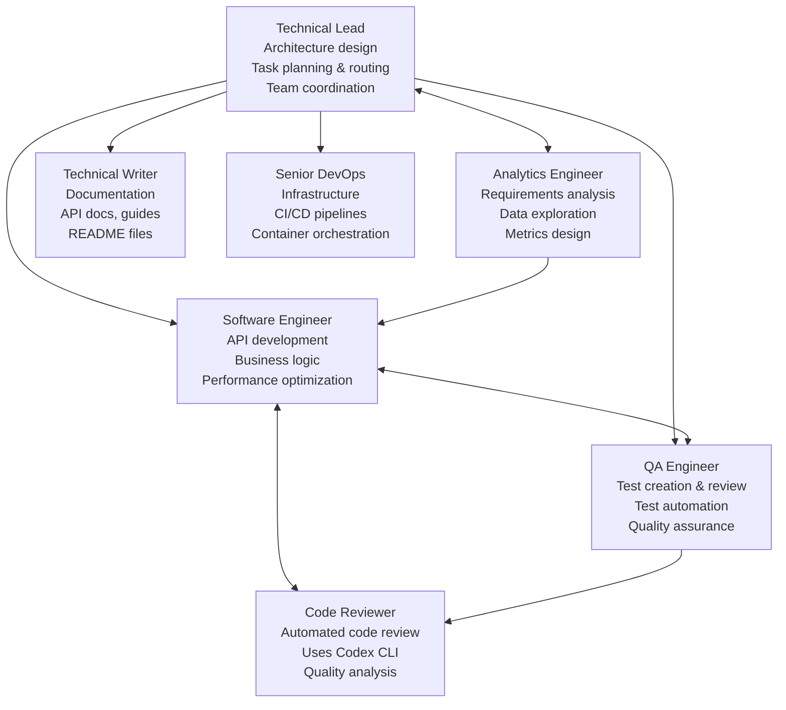
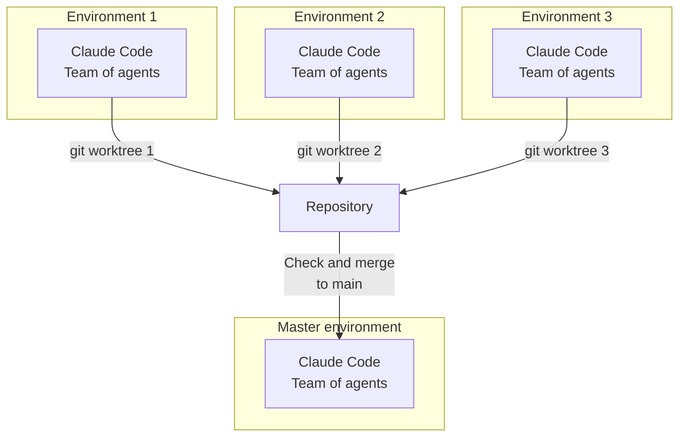

# Isolated AI Development Environments

> ⚠️ **This system is under active development** - expect frequent updates and improvements.

This repository is a **foundation** (with a **full working example**) for per-task, **agent-centric** development.
It lets you run several tasks **in parallel**, each in its **own isolated environment**.

## What it does

* **Per-task isolation.** Each task lives in its own Git **worktree** with its own containers and network.
* **Agent-centric workflow.** The **AI agents** run **together** in the same sandbox (Claude Code, Codex CLI, Gemini CLI …).
* **Pluggable services.** Start the services you need (DBs, object storage, caches, brokers, vector stores, …).
* **Highly customizable.** Swap agents, services, env vars, and compose files without modifying the base.

## Security model

* **Non-root users.** Default user inside containers is **non-root** (user: claude, UID: 1001).
  * **Write access only to:** the **workspace** and the user's **home directory**.
  * No write access elsewhere; **no `sudo`** in images.
  * Group `dev` (GID: 2000) for shared file access between host and container.

* **Restricted networking.** **Default-deny egress**; outbound HTTP/HTTPS goes through **Tinyproxy** with whitelist filtering.
  * **Upstream proxy support:** Optional SOCKS5/HTTP upstream proxy for additional routing (e.g., SSH tunnels).
  * **Dual proxy setup:** Separate proxies for devcontainer and Docker-in-Docker with different whitelists.

* **Isolated Docker.** Docker-in-Docker is **network-isolated** and constrained; it cannot access host Docker or host files.

* **Constrained devcontainer.** Minimal capabilities and internal networking only.

* **Parallel safety.** Multiple environments run side-by-side **without colliding** over resources, tables, or dashboards.

* **Host notifications.** Secure notification system using mounted volumes for container-to-host alerts.

---

# Architecture — Components & Networks


---

# AI Agents

Pre-configured agents included in the base image:



---

# Parallel Tasks — Multi-Environment Workflow



---

## Quick start

1. Build both base images once:

   ```bash
   ./build.sh  # Builds devcontainer and tinyproxy images
   ```

2. Copy the `.devcontainer/` directory into your project root.

3. Configure environment:
   ```bash
   cd .devcontainer
   cp .env.example .env
   # Edit .env to configure proxy settings if needed
   ```

4. Add any project-specific domains to `.devcontainer/whitelist.txt` BEFORE starting the container.

5. Commit the changes locally.

6. Create a task environment (worktree) FIRST:
   ```bash
   # from your main repo
   git worktree add ../task-foo -b feature/task-foo
   cd ../task-foo
   ```

7. Open the worktree in your IDE:
   - **PyCharm:** Open the worktree folder → **Open in Dev Container** (automatically starts services)
   - **VS Code:** Open the worktree folder → Automatically detects `.devcontainer/devcontainer.json`
   - **Other JetBrains IDEs:** Similar to PyCharm

   Note: Each worktree gets its own isolated environment with separate containers.
8. Run claude with flag --dangerously-skip-permissions using `run-claude.sh`

## Network Configuration

### Proxy Filtering
- **Tinyproxy** enforces whitelist-based filtering (default-deny)
- Default whitelisted domains in `common_settings/default-whitelist.txt`:
  - GitHub, GitLab, PyPI, npm registry, JetBrains services
- Add project-specific domains to `.devcontainer/whitelist.txt`

### Upstream Proxy Support
Configure optional upstream proxy in `.devcontainer/.env`:

```bash
# SOCKS5 proxy (e.g., SSH tunnel)
UPSTREAM_SOCKS5=host.docker.internal:8900

# HTTP proxy
UPSTREAM_HTTP=host.docker.internal:3128
```

For SSH tunnels:
```bash
ssh -D 0.0.0.0:8900 your-server  # Creates SOCKS5 proxy
```

### Testing Network
```bash
docker exec devcontainer /home/claude/scripts/test-network.sh
```

## Notification System

The environment includes a host notification system for alerts from Claude Code:

### Setup
1. The `initialize.sh` script automatically creates the notification directory
2. Install inotify-tools:
   ```bash
   sudo apt-get install inotify-tools  # Debian/Ubuntu
   ```
3. Start the notification watcher on your host:
   ```bash
   ./host-scripts/notify-watch.sh
   ```

### How it works
- Claude Code writes notifications to a mounted volume
- Host watcher monitors the directory and shows desktop alerts
- Supports different urgency levels (error, complete, clarification)

### Testing
From within the container:
```bash
/home/claude/claude-defaults/hooks/notify.sh test "Hello from container!"
```

## Customize

* **Agents.** Install or swap agents (Claude Code, Codex CLI, Gemini CLI …).
* **Services.** Edit the *service compose* to add DBs, caches, brokers, vector stores, etc.
* **Policy.** Adjust the proxy whitelist and egress rules; keep default-deny for safety.
* **Overrides.** Use compose overrides and env files to tailor paths, volumes, and resources—while the user stays **non-root** with write access limited to **workspace + home**.

---

*This repository is the **foundation with a complete working example**. It’s minimal, portable, secure by default, and easy to extend for your agents and services.*