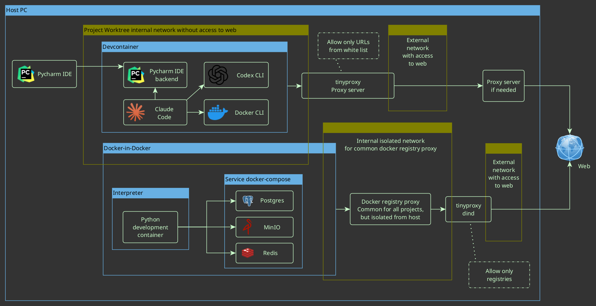

# Isolated AI Development Environments

This repository is a **foundation** (with a **full working example**) for per-task, **agent-centric** development.
It lets you run several tasks **in parallel**, each in its **own isolated environment**, on a **Host PC** or a **Dev-Container PC**.

## What it does

* **Per-task isolation.** Each task lives in its own Git **worktree** with its own containers and network.
* **Agent-centric workflow.** The **user and AI agents** run **together** in the same sandbox (Claude Code, Codex CLI, Gemini CLI, Qwen Coder, …).
* **Pluggable services.** Start the services you need (DBs, object storage, caches, brokers, vector stores, …).
* **Highly customizable.** Swap agents, services, env vars, and compose files without modifying the base.

## Security model (simple, strict, practical)

* **Non-root users.** Default user inside containers is **non-root** (user: claude, UID: 1001).

  * **Write access only to:** the **workspace** and the user's **home directory**.
  * No write access elsewhere; **no `sudo`** in images.
* **Restricted networking.** **Default-deny egress**; outbound HTTP/HTTPS goes through **Tinyproxy** with whitelist filtering.
  * **Upstream proxy support:** Optional SOCKS5/HTTP upstream proxy for additional routing (e.g., SSH tunnels).
* **Isolated Docker.** Docker-in-Docker is **network-isolated** and constrained; it cannot access host Docker or host files.
* **Constrained devcontainer.** Minimal capabilities and internal networking only.
* **Parallel safety.** Multiple environments run side-by-side **without colliding** over resources, tables, or dashboards.

---

# Architecture — Components & Networks



---

# AI Agents


---

# Parallel Tasks — Multi-Environment Workflow


---

## Quick start

1. Build both base images once:

   ```bash
   ./build.sh  # Builds devcontainer and tinyproxy images
   ```

2. Copy the `.devcontainer/` directory into your project root.

3. Configure environment:
   ```bash
   cd .devcontainer
   cp .env.example .env
   # Edit .env to configure proxy settings if needed
   ```

4. **IMPORTANT:** Add any project-specific domains to `.devcontainer/whitelist.txt` BEFORE starting the container.

5. Open the project in your IDE:
   - **VS Code:** Automatically detects `.devcontainer/devcontainer.json`
   - **PyCharm:** Open project → **Open in Dev Container** (automatically initializes and starts services)
   - **Other JetBrains IDEs:** Similar to PyCharm

   Note: PyCharm and VS Code handle initialization automatically when opening in devcontainer mode. No manual `docker compose up` needed.

## Create a task environment (worktree)

```bash
# from your main repo
git worktree add ../task-foo -b feature/task-foo
# open ../task-foo in the IDE; it spins up its own isolated environment
```

## Network Configuration

### Proxy Filtering
- **Tinyproxy** enforces whitelist-based filtering (default-deny)
- Default whitelisted domains in `common_settings/default-whitelist.txt`:
  - GitHub, GitLab, PyPI, npm registry, JetBrains services
- Add project-specific domains to `.devcontainer/whitelist.txt`

### Upstream Proxy Support
Configure optional upstream proxy in `.devcontainer/.env`:

```bash
# SOCKS5 proxy (e.g., SSH tunnel)
UPSTREAM_SOCKS5=host.docker.internal:8900

# HTTP proxy
UPSTREAM_HTTP=host.docker.internal:3128
```

For SSH tunnels:
```bash
ssh -D 0.0.0.0:8900 your-server  # Creates SOCKS5 proxy
```

### Testing Network
```bash
docker exec claude-sandbox /home/claude/scripts/test-network.sh
```

## Customize

* **Agents.** Install or swap agents (Claude Code, Codex CLI, Gemini CLI, Qwen Coder, …).
* **Services.** Edit the *service compose* to add DBs, caches, brokers, vector stores, etc.
* **Policy.** Adjust the proxy whitelist and egress rules; keep default-deny for safety.
* **Overrides.** Use compose overrides and env files to tailor paths, volumes, and resources—while the user stays **non-root** with write access limited to **workspace + home**.

---

*This repository is the **foundation with a complete working example**. It’s minimal, portable, secure by default, and easy to extend for your agents and services.*